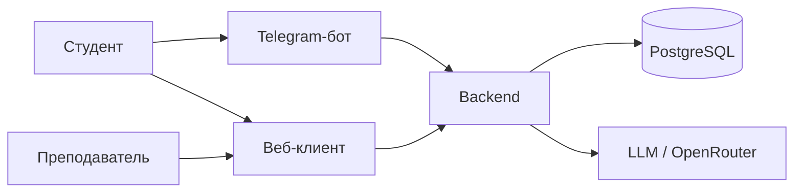

# Сопровождение учебного потока с AI-ассистентом

Система для студентов и преподавателей курсов по разработке и LLM: поддержка между занятиями, прогресс и обзор потока.

> Учебный проект в рамках модуля по AI-driven fullstack-разработке.

## О проекте

Между занятиями студенты часто теряют контекст курса. Продукт даёт AI-ассистента в Telegram и (по плану) веб-клиент с единым backend. Роли: **студент**, **преподаватель**.

## Архитектура

Целевая схема (сейчас в репо — **только бот**, без backend):

Подробности потоков запросов — [docs/vision.md](docs/vision.md).

## Статус

| № | Этап | Статус |
|---|------|--------|
| 1 | Ядро backend и данные | 📋 Planned |
| 2 | Диалог и тонкий бот | 📋 Planned |
| 3 | Структура потока и задания | 📋 Planned |
| 4 | Веб: студент | 📋 Planned |
| 5 | Веб: преподаватель | 📋 Planned |
| 6 | Эксплуатация MVP | 📋 Planned |

DoD и даты — [docs/plan.md](docs/plan.md).

## Документация

- [Идея продукта](docs/idea.md)
- [Архитектурное видение](docs/vision.md)
- [Модель данных](docs/data-model.md)
- [Интеграции](docs/integrations.md)
- [План](docs/plan.md)
- [Задачи](docs/tasks/)

## Быстрый старт

**Бот:** `cp .env.example .env` → заполнить `BOT_TOKEN`, `OPENROUTER_API_KEY`, `LLM_MODEL`, `SYSTEM_PROMPT` → из корня: `make install`, `make run` (`make lint` для проверки). См. также [docs/vision.md](docs/vision.md).

**Backend, веб и общий запуск MVP** — по готовности итераций 1–6; воспроизводимый «полный» стенд ориентировочно к итерации 6, см. [docs/plan.md](docs/plan.md).
