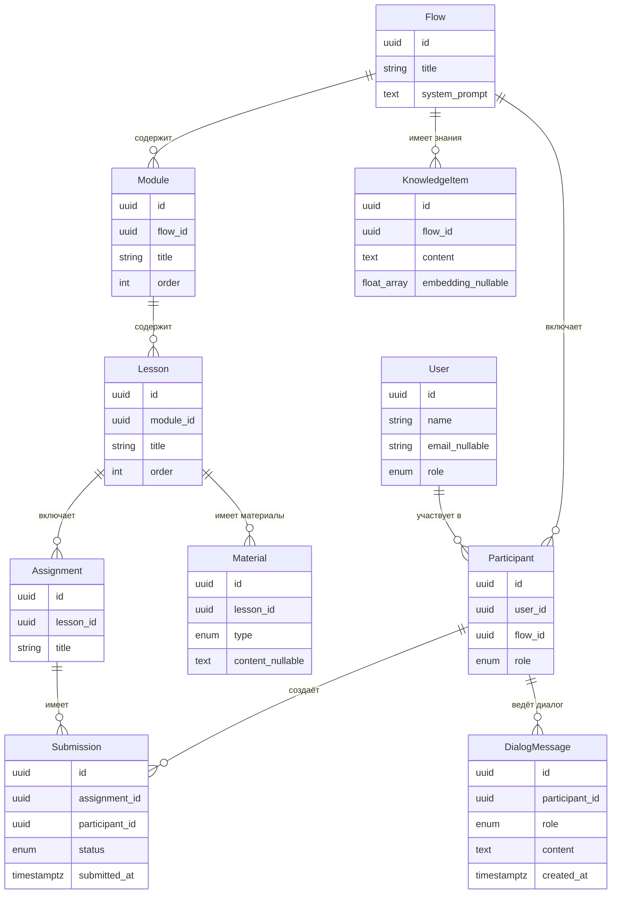
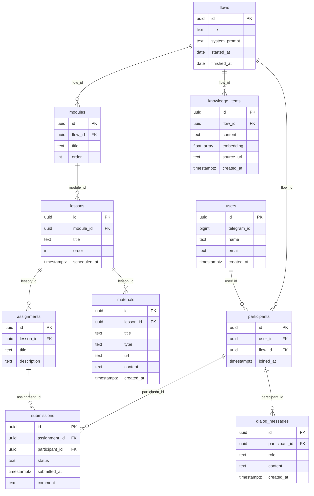

# Модель данных

Описание ключевых сущностей системы сопровождения учебного потока.

Пользовательские сценарии и привязка сущностей к ним: [spec/user-scenarios.md](spec/user-scenarios.md).

**Текущее состояние кода:** миграции **`003_modules_lessons`** и **`004_knowledge_progress`** приводят схему и ORM к DDL ниже (`assignments.lesson_id`, `modules` / `lessons` / `materials`, `knowledge_items`, VIEW прогресса).

---

## Основные сущности

### User — Пользователь

> **Сценарии:** [С1–С3, П1–П3](spec/user-scenarios.md) — идентичность и роль; связь с потоком через `Participant`.

Любой человек в системе: студент или преподаватель.

| Поле | Тип | Описание |
|---|---|---|
| id | UUID | Уникальный идентификатор |
| telegram_id | integer \| null | ID в Telegram (может отсутствовать); уникален среди непустых значений (частичный уникальный индекс) |
| name | string | Отображаемое имя |
| email | string \| null | Для входа через веб; опционально (пользователь только из Telegram может не иметь email). Без значения по умолчанию; уникальность непустых значений — **частичный уникальный индекс** `WHERE email IS NOT NULL` (стандартный `UNIQUE` допускает несколько `NULL`) |
| role | enum | `student` / `teacher` |
| created_at | timestamp | Дата регистрации (в БД: `timestamptz`) |

---

### Flow — Учебный поток

> **Сценарии:** [С1, С3, П1, П3](spec/user-scenarios.md)

Конкретный запуск курса с датами и составом участников.

| Поле | Тип | Описание |
|---|---|---|
| id | UUID | Уникальный идентификатор |
| title | string | Название потока |
| system_prompt | text | Системный промпт для AI-ассистента потока |
| started_at | date | Дата начала (`date`) |
| finished_at | date \| null | Дата окончания |

---

### Participant — Участник потока

> **Сценарии:** [С1–С3, П1, П2](spec/user-scenarios.md)

Связь пользователя с конкретным потоком.

| Поле | Тип | Описание |
|---|---|---|
| id | UUID | Уникальный идентификатор |
| user_id | UUID → User | Пользователь |
| flow_id | UUID → Flow | Поток |
| role | enum | `student` / `teacher` (роль может отличаться в разных потоках) |
| joined_at | timestamp | Дата вступления (`timestamptz`) |

**Инвариант:** пара `(user_id, flow_id)` уникальна (один пользователь не дублируется в одном потоке).

---

### Module — Модуль

> **Сценарии:** [С3, П3](spec/user-scenarios.md)

Раздел курса, объединяющий несколько занятий.

| Поле | Тип | Описание |
|---|---|---|
| id | UUID | Уникальный идентификатор |
| flow_id | UUID → Flow | Принадлежит потоку |
| title | string | Название модуля |
| order | integer | Порядковый номер внутри потока |

**Инвариант:** пара `(flow_id, order)` уникальна.

---

### Lesson — Занятие

> **Сценарии:** [С2, С3, П3](spec/user-scenarios.md)

Конкретное занятие в рамках модуля.

| Поле | Тип | Описание |
|---|---|---|
| id | UUID | Уникальный идентификатор |
| module_id | UUID → Module | Принадлежит модулю |
| title | string | Название занятия |
| order | integer | Порядковый номер внутри модуля |
| scheduled_at | timestamp \| null | Дата и время проведения (`timestamptz`) |

**Инвариант:** пара `(module_id, order)` уникальна.

---

### Material — Учебный материал

> **Сценарии:** [С1, П3](spec/user-scenarios.md) — контент занятия для контекста ассистента (в т.ч. источник для индексации RAG) и управление структурой потока.

Материал, привязанный к занятию.

| Поле | Тип | Описание |
|---|---|---|
| id | UUID | Уникальный идентификатор |
| lesson_id | UUID → Lesson | Занятие |
| title | string | Название / подпись |
| type | enum | `link` \| `file` \| `text` |
| url | string \| null | URL для `link` и `file` |
| content | text \| null | Текст для `type = text` |
| created_at | timestamp | Создано (`timestamptz`) |

**Инвариант:** для `text` задано `content`; для `link` / `file` задан `url`.

---

### Assignment — Домашнее задание

> **Сценарии:** [С2, С3, П1, П3](spec/user-scenarios.md)

Задание, которое студент должен выполнить после занятия.

| Поле | Тип | Описание |
|---|---|---|
| id | UUID | Уникальный идентификатор |
| lesson_id | UUID → Lesson | Привязано к занятию (не к потоку напрямую) |
| title | string | Название задания |
| description | text \| null | Условие / описание |

---

### Submission — Результат выполнения

> **Сценарии:** [С2, С3, П1](spec/user-scenarios.md)

Фиксирует факт сдачи задания студентом (через бота или веб).

| Поле | Тип | Описание |
|---|---|---|
| id | UUID | Уникальный идентификатор |
| assignment_id | UUID → Assignment | Задание |
| participant_id | UUID → Participant | Кто сдал |
| status | enum | `submitted` / `reviewed` / `approved` |
| submitted_at | timestamp | Когда зафиксировано (`timestamptz`) |
| comment | text \| null | Комментарий студента |

**Инвариант:** пара `(participant_id, assignment_id)` уникальна.

---

### DialogMessage — Сообщение диалога

> **Сценарии:** [С1, П2](spec/user-scenarios.md)

Одно сообщение в диалоге студента с AI-ассистентом.

| Поле | Тип | Описание |
|---|---|---|
| id | UUID | Уникальный идентификатор |
| participant_id | UUID → Participant | Чей диалог |
| role | enum | `user` / `assistant` / `system` |
| content | text | Текст сообщения |
| created_at | timestamp | Время сообщения (`timestamptz`) |

> История диалога привязана к участнику потока — при смене потока контекст не переносится.

---

### KnowledgeItem — Фрагмент базы знаний (RAG)

> **Сценарии:** [С1](spec/user-scenarios.md) — семантический поиск по контенту потока для ответа ассистента.

Текстовый фрагмент, принадлежащий потоку, с опциональным вектором для similarity search (расширение **pgvector**).

| Поле | Тип | Описание |
|---|---|---|
| id | UUID | Уникальный идентификатор |
| flow_id | UUID → Flow | Поток |
| content | text | Текст чанка |
| embedding | vector \| null | Вектор (например `vector(1536)`); NULL до индексации. **В текущих миграциях репозитория:** `double precision[]` без pgvector; переход на `vector` — отдельной миграцией. |
| source_url | text \| null | Источник / ссылка для трассировки |
| created_at | timestamp | Создано (`timestamptz`) |

Наполнение из `Material` и пайплайн индексации — отдельная задача backend (итерация 5+).

---

### Progress — Прогресс по заданиям (представление)

> **Сценарии:** [С3](spec/user-scenarios.md)

Не таблица, а **VIEW** `participant_assignment_progress`: декартово произведение структуры потока для участника с левым соединением к сдачам. Одна строка на пару (участник, задание) с полями порядка модуля/занятия и статусом сдачи (если есть).

При росте объёма данных допускается переход на `MATERIALIZED VIEW` и обновление по расписанию — вне MVP.

---

## Связи между сущностями (логическая ER-диаграмма)



---

## Физическая схема PostgreSQL

### Соглашения

- Имена таблиц и колонок: **snake_case** (в SQL зарезервированное слово `order` — в кавычках `"order"`).
- Первичные ключи: **UUID** с `gen_random_uuid()` по умолчанию (согласовано с уже применёнными миграциями; альтернатива `bigint identity` зафиксирована как компромисс в [iteration-2-schema summary](tasks/impl/database/iteration-2-schema/summary.md)).
- Время событий: **`timestamptz`**, не `timestamp without time zone`.
- Перечисления в **документируемом DDL** ниже — `TEXT` + `CHECK`; в действующем коде проекта enum реализованы через **PostgreSQL `CREATE TYPE`** и SQLAlchemy `native_enum=True` — эквивалент по допустимым значениям.
- Расширение **pgvector**: перед `knowledge_items` выполнить `CREATE EXTENSION IF NOT EXISTS vector;` (миграция при внедрении таблицы).
- Индекс **IVFFlat** по `embedding` создаётся **после** накопления данных (обучение списков); до этого возможен последовательный поиск или отсутствие индекса.

### Физическая ER-диаграмма (таблицы, ключевые связи)



**VIEW** `participant_assignment_progress` на диаграмме не показан; определение — в DDL ниже.

### DDL (целевая схема)

```sql
-- users (несколько строк с NULL telegram_id / NULL email допустимы — только частичные UNIQUE)
CREATE TABLE users (
  id UUID PRIMARY KEY DEFAULT gen_random_uuid(),
  telegram_id BIGINT,
  name TEXT NOT NULL,
  email TEXT,
  role TEXT NOT NULL CHECK (role IN ('student', 'teacher')),
  created_at TIMESTAMPTZ NOT NULL DEFAULT now()
);
CREATE UNIQUE INDEX uq_users_telegram_id_not_null ON users (telegram_id) WHERE telegram_id IS NOT NULL;
CREATE UNIQUE INDEX uq_users_email_lower_not_null ON users (LOWER(email)) WHERE email IS NOT NULL;

-- flows
CREATE TABLE flows (
  id UUID PRIMARY KEY DEFAULT gen_random_uuid(),
  title TEXT NOT NULL,
  system_prompt TEXT NOT NULL,
  started_at DATE NOT NULL,
  finished_at DATE
);
CREATE INDEX idx_flows_started_at ON flows (started_at);

-- participants
CREATE TABLE participants (
  id UUID PRIMARY KEY DEFAULT gen_random_uuid(),
  user_id UUID NOT NULL REFERENCES users(id) ON DELETE CASCADE,
  flow_id UUID NOT NULL REFERENCES flows(id) ON DELETE CASCADE,
  role TEXT NOT NULL CHECK (role IN ('student', 'teacher')),
  joined_at TIMESTAMPTZ NOT NULL DEFAULT now(),
  UNIQUE (user_id, flow_id)
);
CREATE INDEX idx_participants_user_id ON participants (user_id);
CREATE INDEX idx_participants_flow_id ON participants (flow_id);

-- modules
CREATE TABLE modules (
  id UUID PRIMARY KEY DEFAULT gen_random_uuid(),
  flow_id UUID NOT NULL REFERENCES flows(id) ON DELETE CASCADE,
  title TEXT NOT NULL,
  "order" INTEGER NOT NULL,
  UNIQUE (flow_id, "order")
);
CREATE INDEX idx_modules_flow_id ON modules (flow_id);

-- lessons
CREATE TABLE lessons (
  id UUID PRIMARY KEY DEFAULT gen_random_uuid(),
  module_id UUID NOT NULL REFERENCES modules(id) ON DELETE CASCADE,
  title TEXT NOT NULL,
  "order" INTEGER NOT NULL,
  scheduled_at TIMESTAMPTZ,
  UNIQUE (module_id, "order")
);
CREATE INDEX idx_lessons_module_id ON lessons (module_id);

-- assignments (целевое состояние после migration 003)
CREATE TABLE assignments (
  id UUID PRIMARY KEY DEFAULT gen_random_uuid(),
  lesson_id UUID NOT NULL REFERENCES lessons(id) ON DELETE CASCADE,
  title TEXT NOT NULL,
  description TEXT
);
CREATE INDEX idx_assignments_lesson_id ON assignments (lesson_id);

-- submissions
CREATE TABLE submissions (
  id UUID PRIMARY KEY DEFAULT gen_random_uuid(),
  assignment_id UUID NOT NULL REFERENCES assignments(id) ON DELETE CASCADE,
  participant_id UUID NOT NULL REFERENCES participants(id) ON DELETE CASCADE,
  status TEXT NOT NULL CHECK (status IN ('submitted', 'reviewed', 'approved')),
  submitted_at TIMESTAMPTZ NOT NULL DEFAULT now(),
  comment TEXT,
  UNIQUE (participant_id, assignment_id)
);
CREATE INDEX idx_submissions_participant_id ON submissions (participant_id);
CREATE INDEX idx_submissions_assignment_id ON submissions (assignment_id);
CREATE INDEX idx_submissions_participant_submitted_at ON submissions (participant_id, submitted_at);

-- dialog_messages
CREATE TABLE dialog_messages (
  id UUID PRIMARY KEY DEFAULT gen_random_uuid(),
  participant_id UUID NOT NULL REFERENCES participants(id) ON DELETE CASCADE,
  role TEXT NOT NULL CHECK (role IN ('user', 'assistant', 'system')),
  content TEXT NOT NULL,
  created_at TIMESTAMPTZ NOT NULL DEFAULT now()
);
CREATE INDEX idx_dialog_messages_participant_created_at ON dialog_messages (participant_id, created_at);

-- materials
CREATE TABLE materials (
  id UUID PRIMARY KEY DEFAULT gen_random_uuid(),
  lesson_id UUID NOT NULL REFERENCES lessons(id) ON DELETE CASCADE,
  title TEXT NOT NULL,
  type TEXT NOT NULL CHECK (type IN ('link', 'file', 'text')),
  url TEXT,
  content TEXT,
  created_at TIMESTAMPTZ NOT NULL DEFAULT now(),
  CHECK (
    (type = 'text' AND content IS NOT NULL) OR
    (type IN ('link', 'file') AND url IS NOT NULL)
  )
);
CREATE INDEX idx_materials_lesson_id ON materials (lesson_id);

-- knowledge_items (в репозитории: embedding как float8[]; целевой pgvector — отдельная миграция)
CREATE TABLE knowledge_items (
  id UUID PRIMARY KEY DEFAULT gen_random_uuid(),
  flow_id UUID NOT NULL REFERENCES flows(id) ON DELETE CASCADE,
  content TEXT NOT NULL,
  embedding DOUBLE PRECISION[],
  source_url TEXT,
  created_at TIMESTAMPTZ NOT NULL DEFAULT now()
);
CREATE INDEX idx_knowledge_items_flow_id ON knowledge_items (flow_id);
-- При переходе на pgvector: тип embedding → vector(1536); IVFFlat после наполнения.

-- прогресс по заданиям для участника (VIEW)
CREATE VIEW participant_assignment_progress AS
SELECT
  p.id AS participant_id,
  p.flow_id,
  m.id AS module_id,
  m."order" AS module_order,
  l.id AS lesson_id,
  l."order" AS lesson_order,
  a.id AS assignment_id,
  s.status,
  s.submitted_at
FROM participants p
JOIN modules m ON m.flow_id = p.flow_id
JOIN lessons l ON l.module_id = m.id
JOIN assignments a ON a.lesson_id = l.id
LEFT JOIN submissions s ON s.assignment_id = a.id AND s.participant_id = p.id;
```

### Индексы и ревью (кратко)

| Объект | Назначение |
|--------|------------|
| FK-колонки | B-tree индекс на каждой ссылающейся колонке (PostgreSQL FK не индексирует автоматически) |
| `users`: `telegram_id`, `LOWER(email)` | частичные UNIQUE при не-NULL (много пользователей без Telegram / без email) |
| `participants (user_id, flow_id)` | UNIQUE |
| `modules (flow_id, order)`, `lessons (module_id, order)` | UNIQUE |
| `submissions (participant_id, assignment_id)` | UNIQUE |
| `dialog_messages (participant_id, created_at)` | выборка истории по времени |
| `submissions (participant_id, submitted_at)` | прогресс / лента сдач |
| `flows (started_at)` | отбор потоков по датам |
| `knowledge_items` IVFFlat | similarity search после наполнения |

**Технический долг (существующие миграции):** в уже созданных таблицах `users`, `flows` и др. могут использоваться `VARCHAR(n)` вместо `TEXT`; новые таблицы — `TEXT`. Приведение — отдельной миграцией по необходимости.

---

## Выбор СУБД

**PostgreSQL** — основное хранилище для всех сущностей.

Обоснование:

- Реляционная структура хорошо подходит для связанных сущностей: поток → участники → задания → сдачи.
- Надёжные транзакции, понятная схема, широкая экосистема.
- Стандартный выбор для Python-backend (asyncpg, SQLAlchemy).

**pgvector** — расширение PostgreSQL для векторного поиска по таблице `knowledge_items`.

```
PostgreSQL
└── pgvector (CREATE EXTENSION vector)
    └── knowledge_items.embedding → RAG по потоку
```
