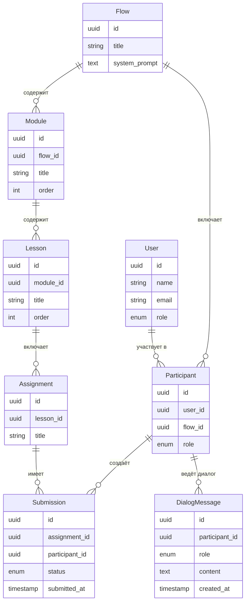

# Модель данных

Описание ключевых сущностей системы сопровождения учебного потока.

---

## Основные сущности

### User — Пользователь

Любой человек в системе: студент или преподаватель.

| Поле | Тип | Описание |
|---|---|---|
| id | UUID | Уникальный идентификатор |
| telegram_id | integer | ID в Telegram (может отсутствовать) |
| name | string | Отображаемое имя |
| email | string | Для входа через веб |
| role | enum | `student` / `teacher` |
| created_at | timestamp | Дата регистрации |

---

### Flow — Учебный поток

Конкретный запуск курса с датами и составом участников.

| Поле | Тип | Описание |
|---|---|---|
| id | UUID | Уникальный идентификатор |
| title | string | Название потока |
| system_prompt | text | Системный промпт для AI-ассистента потока |
| started_at | date | Дата начала |
| finished_at | date | Дата окончания (может быть null) |

---

### Participant — Участник потока

Связь пользователя с конкретным потоком.

| Поле | Тип | Описание |
|---|---|---|
| id | UUID | Уникальный идентификатор |
| user_id | UUID → User | Пользователь |
| flow_id | UUID → Flow | Поток |
| role | enum | `student` / `teacher` (роль может отличаться в разных потоках) |
| joined_at | timestamp | Дата вступления |

---

### Module — Модуль

Раздел курса, объединяющий несколько занятий.

| Поле | Тип | Описание |
|---|---|---|
| id | UUID | Уникальный идентификатор |
| flow_id | UUID → Flow | Принадлежит потоку |
| title | string | Название модуля |
| order | integer | Порядковый номер |

---

### Lesson — Занятие

Конкретное занятие в рамках модуля.

| Поле | Тип | Описание |
|---|---|---|
| id | UUID | Уникальный идентификатор |
| module_id | UUID → Module | Принадлежит модулю |
| title | string | Название занятия |
| order | integer | Порядковый номер |
| scheduled_at | timestamp | Дата и время проведения |

---

### Assignment — Домашнее задание

Задание, которое студент должен выполнить после занятия.

| Поле | Тип | Описание |
|---|---|---|
| id | UUID | Уникальный идентификатор |
| lesson_id | UUID → Lesson | Привязано к занятию |
| title | string | Название задания |
| description | text | Условие / описание |

---

### Submission — Результат выполнения

Фиксирует факт сдачи задания студентом (через бота или веб).

| Поле | Тип | Описание |
|---|---|---|
| id | UUID | Уникальный идентификатор |
| assignment_id | UUID → Assignment | Задание |
| participant_id | UUID → Participant | Кто сдал |
| status | enum | `submitted` / `reviewed` / `approved` |
| submitted_at | timestamp | Когда зафиксировано |
| comment | text | Комментарий студента (опционально) |

---

### DialogMessage — Сообщение диалога

Одно сообщение в диалоге студента с AI-ассистентом.

| Поле | Тип | Описание |
|---|---|---|
| id | UUID | Уникальный идентификатор |
| participant_id | UUID → Participant | Чей диалог |
| role | enum | `user` / `assistant` / `system` |
| content | text | Текст сообщения |
| created_at | timestamp | Время сообщения |

> История диалога привязана к участнику потока — при смене потока контекст не переносится.

---

## Связи между сущностями



---

## Выбор СУБД

**PostgreSQL** — основное хранилище для всех сущностей.

Обоснование:
- Реляционная структура хорошо подходит для связанных сущностей: поток → участники → задания → сдачи.
- Надёжные транзакции, понятная схема, широкая экосистема.
- Стандартный выбор для Python-backend (asyncpg, SQLAlchemy).

**pgvector** — расширение PostgreSQL для векторного поиска.

Когда понадобится: при добавлении RAG (поиск по материалам потока). Подключается как расширение к той же БД — смена СУБД не требуется.

```
PostgreSQL
└── pgvector (расширение, добавляется при необходимости)
    └── таблица embeddings → материалы / FAQ потока
```
