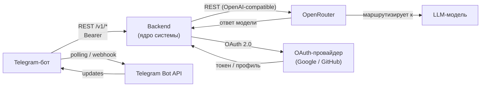

# Внешние интеграции

Описание внешних систем, с которыми взаимодействует продукт.

---

## Карта интеграций

---

## Внешние системы

### Telegram Bot API

| Атрибут | Значение |
|---|---|
| Сервис | [api.telegram.org](https://core.telegram.org/bots/api) |
| Назначение | Доставка сообщений студентам, приём команд и текстовых сообщений |
| Направление | Bidirectional |
| Протокол | HTTPS REST; polling на MVP, webhook — опционально |
| Критичность | **MVP** — без этого бот не работает |

Бот опрашивает Telegram по расписанию (polling), получает `Update`-объекты и отправляет ответы через `sendMessage`. Webhook может заменить polling при деплое без потери функциональности.

---

### Backend HTTP API (вызов из бота, MVP)

| Атрибут | Значение |
|---|---|
| Назначение | Сценарии «сообщение ассистенту» и «фиксация сдачи ДЗ» через backend (ядро) |
| Направление | Bot → Backend (HTTPS REST, префикс `/v1/`) |
| Аутентификация | Заголовок `Authorization: Bearer <INTERNAL_API_TOKEN>` — общий секрет backend и бота, только в `.env` |
| Контракт | [`docs/api/backend-v1.openapi.yaml`](api/backend-v1.openapi.yaml) |
| Критичность | **MVP** после перевода бота на HTTP (см. итерация 7 tasklist-backend) |

Переменные окружения (пример имён — см. [`.env.example`](../.env.example)):

- `BACKEND_BASE_URL` — базовый URL сервиса (например `http://127.0.0.1:8000`), без завершающего `/`.
- `INTERNAL_API_TOKEN` — значение Bearer; отсутствие или несовпадение с тем, что проверяет backend, даёт ответ `401` с телом ошибки по контракту.

Идентификация пользователя в теле запросов: `telegram_user_id` (целое) + `flow_id` (UUID); backend резолвит `User` и `Participant` (см. [`docs/data-model.md`](data-model.md)).

---

### OpenRouter

| Атрибут | Значение |
|---|---|
| Сервис | [openrouter.ai](https://openrouter.ai) |
| Назначение | Доступ к LLM-моделям для генерации ответов AI-ассистента |
| Направление | Out (запрос) → In (ответ) |
| Протокол | HTTPS REST, OpenAI-compatible API (`/chat/completions`) |
| Критичность | **MVP** — без этого ассистент не отвечает |

Backend отправляет запрос с системным промптом и историей диалога, получает текстовый ответ. Конкретная модель задаётся через конфигурацию (`LLM_MODEL`). OpenRouter маршрутизирует запрос к выбранной модели (OpenAI, Anthropic, Mistral и др.).

---

### OAuth-провайдер (Google / GitHub)

| Атрибут | Значение |
|---|---|
| Сервис | Google Identity / GitHub OAuth |
| Назначение | Аутентификация пользователей в веб-приложении |
| Направление | Out (редирект) → In (токен + профиль) |
| Протокол | OAuth 2.0 / OIDC |
| Критичность | **Future** — нужен при запуске веб-интерфейса |

Студент и преподаватель входят в веб-приложение через сторонний провайдер. Backend получает токен, верифицирует его и создаёт/находит пользователя в системе.

---

## Зависимости и риски

| Интеграция | Риск | Митигация |
|---|---|---|
| **Telegram Bot API** | Недоступность API или блокировка | Логировать ошибки, предусмотреть graceful retry |
| **OpenRouter** | Деградация модели, превышение квоты, latency | Обрабатывать ошибки API, настроить таймауты, иметь fallback-модель в конфиге |
| **OAuth-провайдер** | Изменения в API провайдера | Использовать стандартный OIDC-flow, не завязываться на специфику одного провайдера |

**Критичные интеграции для MVP:** Telegram Bot API и OpenRouter — обе обязательны. Отказ любой из них делает ключевой сценарий недоступным.

**Внешние зависимости без контроля:** тарификация и доступность OpenRouter зависят от третьей стороны. Выбор модели через конфигурацию позволяет быстро переключиться при необходимости.
