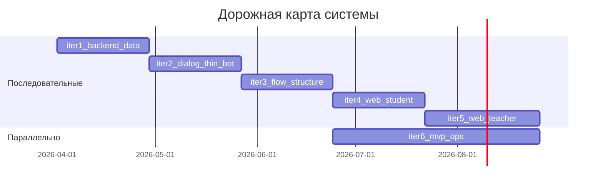

# Дорожная карта развития системы

## Организация работ

Этот документ фиксирует **сквозные** продуктовые этапы: какую ценность получает пользователь или команда после каждого шага. Детальная декомпозиция по областям — в `docs/tasks/tasklist-<область>.md` и артефактах [`docs/tasks/impl/`](tasks/impl/). Этап дорожной карты может затрагивать несколько областей; у каждого этапа указан **ведущий** tasklist; смежные области (например backend и бот) обновляются в той же фазе без отдельной строки в Gantt.

## Ключевые особенности плана

1. **Backend-first / единое ядро** — бизнес-логика и вызовы LLM сосредоточены в backend; Telegram-бот и веб — клиенты одного API ([`docs/vision.md`](vision.md)).
2. **KISS и границы MVP** — простой повторяемый запуск, без Kubernetes, брокеров и лишней инфраструктуры на старте ([`docs/vision.md`](vision.md)).
3. **Spec-driven** — этапы согласованы с [`docs/data-model.md`](data-model.md), [`docs/integrations.md`](integrations.md) и [`docs/adr/`](adr/README.md); исполнение ведётся по шаблону [`docs/templates/workflow.md`](templates/workflow.md).

## Легенда статусов

📋 Planned — запланирован  
🚧 In Progress — в работе  
✅ Done — завершён

---

## Обзор итераций

| Итерация | Название | Цель | Статус | Tasklist |
|----------|----------|------|--------|----------|
| 1 | Ядро backend и данные | Серверное ядро, PostgreSQL, базовый домен пользователей и потока | 📋 Planned | [tasklist-backend.md](tasks/tasklist-backend.md) |
| 2 | Диалог и тонкий бот | API сообщений и истории в БД, LLM через backend; бот как HTTP-клиент | 📋 Planned | [tasklist-backend.md](tasks/tasklist-backend.md), [tasklist-bot.md](tasks/tasklist-bot.md) |
| 3 | Структура потока и задания | Модули, занятия, задания и сдачи по модели данных; API под сценарии vision | 📋 Planned | [tasklist-backend.md](tasks/tasklist-backend.md) |
| 4 | Веб: студент | OAuth, прогресс и статусы заданий в веб-клиенте | 📋 Planned | [tasklist-web.md](tasks/tasklist-web.md) |
| 5 | Веб: преподаватель | Обзор группы, активность, управление структурой потока | 📋 Planned | [tasklist-web.md](tasks/tasklist-web.md) |
| 6 | Эксплуатация MVP | Повторяемый запуск, согласованные секреты и `.env`, базовая наблюдаемость | 📋 Planned | [tasklist-infra.md](tasks/tasklist-infra.md) |

*Текущее состояние репозитория до этапа 2: автономный бот без backend — не отдельная строка таблицы; этап 2 закрывает переход на архитектуру из vision.*

---

## Итерации

### Итерация 1: Ядро backend и данные

**Цель:** Запустить серверное ядро с подключением к PostgreSQL и минимальным персистентным доменом (пользователь, поток, участие).

**⚡ Параллельность:** Не зависит от веба; документацию к API можно уточнять параллельно без отдельного этапа.

**Критерии завершения (DoD):**

- Поднимается процесс backend с конфигурацией из окружения; к PostgreSQL выполняется подключение.
- Применяются миграции схемы, согласованные с [`docs/data-model.md`](data-model.md) для базовых сущностей (User, Flow, Participant и связи).
- Есть проверяемые операции чтения/записи по этому домену (например создание потока и участника).
- `make lint` (или эквивалент для backend) проходит для затронутого кода.

**Связь с tasklist:** [tasklist-backend.md](tasks/tasklist-backend.md)

**Полезный результат:** Команда может хранить пользователей и состав потока в одной СУБД; дальнейшие фичи опираются на это ядро.

**Артефакты:** каталог `backend/`, миграции, при необходимости ADR дополнения к [`docs/adr/adr-001-database.md`](adr/adr-001-database.md).

---

### Итерация 2: Диалог и тонкий бот

**Цель:** Реализовать сценарий «сообщение студента → ответ ассистента» через backend (история и LLM на сервере), бот только проксирует запросы к API.

**⚡ Параллельность:** После стабилизации контракта сообщений можно начинать чёрновую работу над UI студента на моках; продакшен-интеграция веба — с этапа 4.

**Критерии завершения (DoD):**

- Реализованы операции сохранения и выдачи истории диалога в БД (в терминах [`docs/data-model.md`](data-model.md): DialogMessage и связанные поля).
- Backend вызывает OpenRouter по правилам [`docs/integrations.md`](integrations.md) и [`docs/vision.md`](vision.md); секреты не попадают в логи.
- Telegram-бот обрабатывает входящие сообщения через HTTP(S) к backend, без локального вызова LLM в боте.
- Сквозной сценарий «сообщение в Telegram → ответ пользователю» воспроизводим на локальном стенде.

**Связь с tasklist:** [tasklist-backend.md](tasks/tasklist-backend.md), [tasklist-bot.md](tasks/tasklist-bot.md)

**Полезный результат:** Студент получает ответы ассистента в боте с учётом истории и политики потока; данные диалога переживают перезапуск.

**Артефакты:** расширение `backend/`, переработка `bot/` (конфиг с URL API и т.д.), обновление `.env.example`.

---

### Итерация 3: Структура потока и задания

**Цель:** Доступны структура курса в потоке (модули, занятия, задания) и фиксация сдач, как в пользовательских сценариях [`docs/vision.md`](vision.md).

**⚡ Параллельность:** После появления read-API прогресса можно параллельно вести этап 4 (студент) и этап 6 (инфра) на хвосте этапа.

**Критерии завершения (DoD):**

- В БД и API отражены Module, Lesson, Assignment, Submission (и при необходимости Material) согласно [`docs/data-model.md`](data-model.md).
- Студент через бот может зафиксировать сдачу задания; состояние видно при последующем запросе к API.
- Преподаватель или сервисная роль может создавать и изменять структуру потока через API (минимальный teacher-facing контур до веба).
- Документированы или версионируются контракты API; при существенных изменениях обновляются `integrations` / ADR.

**Связь с tasklist:** [tasklist-backend.md](tasks/tasklist-backend.md)

**Полезный результат:** Прогресс и сдачи привязаны к реальной структуре потока, а не к заглушкам.

**Артефакты:** расширение `backend/`, обновление `bot/` под сценарии сдачи, при необходимости фрагменты [`docs/integrations.md`](integrations.md).

---

### Итерация 4: Веб: студент

**Цель:** Студент видит прогресс и статусы заданий в веб-клиенте с авторизацией через OAuth-провайдера из [`docs/integrations.md`](integrations.md).

**⚡ Параллельность:** UI и OAuth можно разводить по веткам после готовности read-API прогресса (хвост этапа 3); этап 6 может идти параллельно.

**Критерии завершения (DoD):**

- Реализован вход студента (OAuth) и сопоставление с учётной записью в системе.
- В интерфейсе отображаются данные прогресса и заданий, согласованные с backend (без расхождения с моделью).
- Разграничение: студент не видит teacher-only данные.
- Сборка и локальный запуск web описаны (README или `docs`).

**Связь с tasklist:** [tasklist-web.md](tasks/tasklist-web.md)

**Полезный результат:** Студент пользуется вебом как вторым клиентом рядом с ботом.

**Артефакты:** каталог `web/`, настройки OAuth, обновление `.env.example`.

---

### Итерация 5: Веб: преподаватель

**Цель:** Преподаватель через веб управляет структурой потока и видит активность группы, в соответствии с [`docs/vision.md`](vision.md).

**⚡ Параллельность:** Зависит от teacher API (этап 3) и стабильной авторизации (этап 4); может пересекаться по времени с завершением этапа 6, если ядро уже в проде.

**Критерии завершения (DoD):**

- Роль преподавателя ограничена своим потоком (или явно описанной моделью доступа).
- Доступны операции управления модулями/занятиями/заданиями и просмотр сводок по группе (как минимум read; write — в рамках MVP vision).
- Нет утечки данных между потоками при проверочных сценариях.
- Документация для преподавателя или команды обновлена кратко.

**Связь с tasklist:** [tasklist-web.md](tasks/tasklist-web.md)

**Полезный результат:** Преподаватель ведёт поток и видит состояние группы без обходных SQL-инструментов.

**Артефакты:** расширение `web/`, при необходимости политики в `backend/`.

---

### Итерация 6: Эксплуатация MVP

**Цель:** Предсказуемый запуск компонентов (backend, БД, бот, web) и единая схема секретов для команды и окружений.

**⚡ Параллельность:** Может стартовать после устойчивого контура этапа 3 и вестись **параллельно** этапам 4–5 (compose, CI-черновик, runbooks).

**Критерии завершения (DoD):**

- Описан и проверен сценарий «с нуля»: переменные из `.env.example`, поднятие зависимостей, запуск всех компонентов MVP.
- Логирование соответствует правилам [`docs/vision.md`](vision.md) (без содержимого сообщений и секретов).
- Зафиксирован минимальный набор health/readiness или иных проверок жизнеспособности backend.
- Изменения в интеграциях (URL, OAuth redirect) отражены в [`docs/integrations.md`](integrations.md) при необходимости.

**Связь с tasklist:** [tasklist-infra.md](tasks/tasklist-infra.md)

**Полезный результат:** Команда может воспроизводимо поднять систему и сопровождать её без «магических» шагов.

**Артефакты:** например `docker-compose`/аналог, фрагменты в `README.md`, при необходимости ADR по деплою.

---

## Диаграмма Ганта

Условные длительности; этап `t6` начинается после завершения структуры потока (`t3`) и перекрывается с веб-итерациями `t4` и `t5`.
