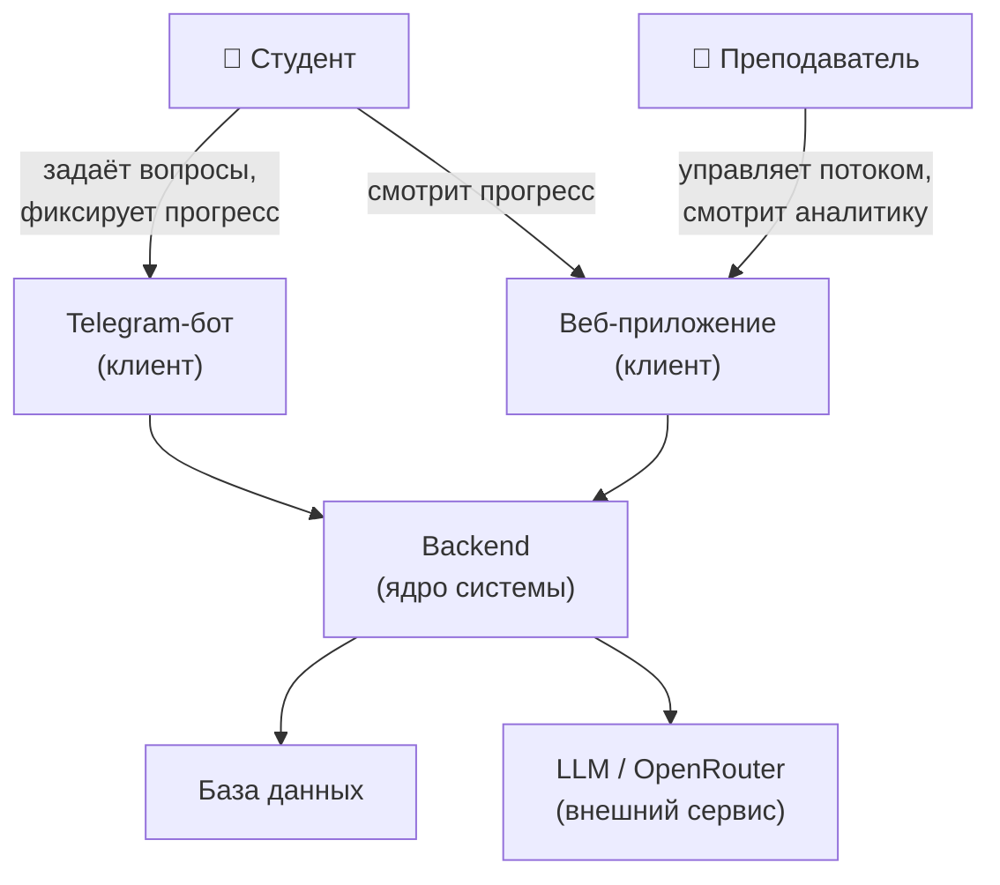
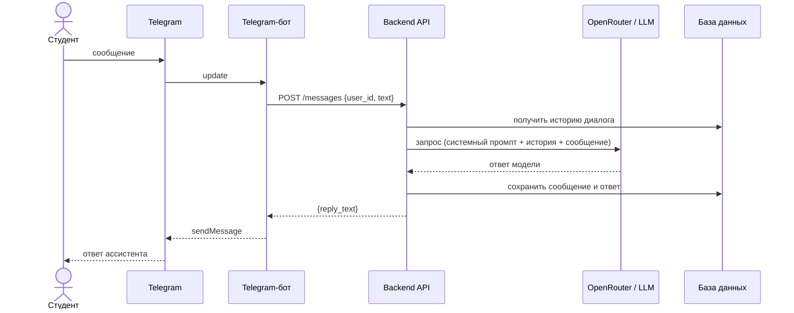
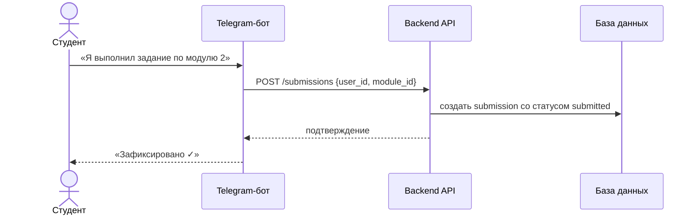

# Техническое видение продукта

Система сопровождения учебного потока с AI-ассистентом. Помогает студентам получать поддержку в любой момент, а преподавателям — понимать состояние потока.

---

## Границы системы

Продукт — не только Telegram-бот. Это многокомпонентная система с единым серверным ядром и несколькими клиентами.



**Ключевой принцип:** бот — первый клиент системы, но не её ядро. Вся бизнес-логика живёт в backend. Telegram-бот и веб-приложение — клиенты, которые общаются с одним backend.

---

## Роли и акторы

| Роль | Описание |
|---|---|
| **Студент** | Участник учебного потока. Взаимодействует с ассистентом, фиксирует выполнение заданий, отслеживает прогресс. |
| **Преподаватель** | Ведёт поток. Настраивает контекст ассистента, просматривает активность и результаты группы. |

---

## Пользовательские сценарии

### Студент — через Telegram-бот

- Задать вопрос по материалу курса и получить ответ в контексте роли ассистента.
- Разобрать ошибку в рассуждении или формулировке задания.
- Сформулировать следующий шаг, когда «застрял».
- Отметить выполнение задания — бот фиксирует это в системе.

### Студент — через веб-приложение

- Просматривать свой прогресс по модулям и занятиям.
- Видеть статус домашних заданий.
- Получить доступ к материалам потока.

### Преподаватель — через веб-приложение

- Видеть активность всей группы и отдельных студентов.
- Просматривать результаты и статусы сдачи заданий.
- Понимать, какие темы вызывают наибольшие затруднения.
- Управлять структурой потока: модули, занятия, задания.

---

## Архитектура (high-level)

### Компоненты системы

| Компонент | Роль |
|---|---|
| **Telegram-бот** | Первый клиент. Принимает сообщения пользователя, отправляет запросы к backend, возвращает ответы. Не содержит бизнес-логики. |
| **Веб-приложение** | Второй клиент. SPA с разными интерфейсами для студента и преподавателя. Работает через API backend. |
| **Backend** | Ядро системы. Содержит всю бизнес-логику: управление потоком, обработка прогресса, работа с LLM, авторизация ролей. |
| **База данных** | Хранит пользователей, структуру курса, прогресс, результаты, историю диалогов. |
| **LLM (OpenRouter)** | Внешний сервис. Backend обращается к нему для генерации ответов ассистента. |

### Поток данных — запрос студента в боте



### Поток данных — фиксация результата



---

## Доменные сущности

> Детализация структуры данных — в `docs/data-model.md`.

| Сущность | Описание |
|---|---|
| **User** | Пользователь системы (студент или преподаватель). |
| **Flow** | Учебный поток — конкретный запуск курса. |
| **Participant** | Участник потока — связь пользователя и потока с ролью. |
| **Module** | Раздел курса, объединяет занятия. |
| **Lesson** | Конкретное занятие в рамках модуля. |
| **Material** | Учебный материал, прикреплённый к занятию. |
| **Assignment** | Домашнее задание, связанное с занятием. |
| **Submission** | Результат выполнения задания студентом. |
| **Progress** | Агрегированный статус прохождения потока. |
| **DialogMessage** | Сообщение в диалоге с AI-ассистентом. |
| **KnowledgeItem** | Единица базы знаний курса (FAQ, определение). |

---

## Внешние интеграции

> Детализация — в `docs/integrations.md`.

| Сервис | Роль | Характер интеграции |
|---|---|---|
| **Telegram Bot API** | Доставка сообщений студентам | Polling / Webhook |
| **OpenRouter** | Доступ к LLM-моделям | REST API (OpenAI-compatible) |

---

## Архитектурные решения

Ключевые архитектурные решения фиксируются в виде ADR (Architecture Decision Record).

> Полный список и детали — в [`docs/adr/`](adr/README.md).

| # | Решение | Статус |
|---|---|---|
| [ADR-001](adr/adr-001-database.md) | Выбор СУБД — PostgreSQL | Принято |

---

## Принципы разработки

- **KISS** — минимум абстракций, линейный и читаемый код.
- **Один компонент — одна ответственность**: bot, backend, web не смешивают чужую логику.
- **Минимум зависимостей** — только то, без чего задача не решается.
- **Конфигурация через окружение** — секреты и настройки в `.env`, код от них не зависит напрямую.
- **Отказ от решений «на будущее»** — паттерны появляются, когда они нужны сейчас.
- **Простой запуск** — локальная разработка не требует сложной инфраструктуры.
- **Ранний линтинг** — `ruff` проверяет код до коммита.

---

## Структура репозитория

```
project-root/
├── bot/                     # Telegram-бот (клиент)
│   ├── main.py
│   ├── handlers.py
│   ├── llm_client.py
│   └── config.py
├── backend/                 # Серверное ядро
│   ├── main.py
│   ├── api/                 # Маршруты
│   ├── services/            # Бизнес-логика
│   ├── models/              # Доменные модели
│   └── config.py
├── web/                     # Веб-приложение (клиент)
│   ├── src/
│   │   ├── pages/
│   │   └── components/
│   └── package.json
├── docs/
│   ├── idea.md
│   ├── vision.md
│   ├── data-model.md        # детализация доменной модели
│   ├── integrations.md      # детализация внешних интеграций
│   └── adr/                 # архитектурные решения
│       ├── README.md
│       └── adr-001-database.md
├── .env.example
├── .gitignore
├── Makefile
└── README.md
```

---

## Технологии

### Backend

| Назначение | Инструмент |
|---|---|
| Язык | Python 3.12+ |
| Менеджер зависимостей | uv |
| Линтер / форматтер | ruff |
| LLM-клиент | openai (OpenAI-compatible SDK) |
| LLM-провайдер | OpenRouter |
| Конфигурация | python-dotenv, .env |

### Bot

| Назначение | Инструмент |
|---|---|
| Telegram-фреймворк | aiogram 3.x, polling |
| Автоматизация | make (Makefile) |

### Web

| Назначение | Инструмент |
|---|---|
| Язык / фреймворк | уточняется |
| Интерфейсы | студент, преподаватель (единый проект, разные роли) |

---

## Конфигурация и секреты

Все настройки загружаются из `.env` через `python-dotenv`. Код не содержит хардкода секретов.

| Переменная | Описание | Обязательна |
|---|---|---|
| `BOT_TOKEN` | Telegram Bot API токен | да |
| `OPENROUTER_API_KEY` | Ключ OpenRouter | да |
| `LLM_MODEL` | Идентификатор модели, например `openai/gpt-4o-mini` | да |
| `SYSTEM_PROMPT` | Системный промпт для ассистента | да |
| `LLM_TEMPERATURE` | Температура генерации (по умолчанию `0.7`) | нет |
| `LLM_MAX_TOKENS` | Максимум токенов в ответе | нет |
| `MAX_HISTORY_MESSAGES` | Лимит сообщений в истории диалога | нет |
| `LOG_LEVEL` | Уровень логирования (по умолчанию `INFO`) | нет |

Правила:
- `.env` не коммитится (в `.gitignore`).
- В репозитории хранится `.env.example` со всеми ключами.
- Конфигурация загружается один раз при старте.

---

## Логирование

Используется стандартный модуль `logging`. Сторонние библиотеки не подключаются.

| Уровень | Что логируется |
|---|---|
| `INFO` | Запуск компонентов, входящие события (без содержимого). |
| `WARNING` | Нештатные ситуации, не прерывающие работу. |
| `ERROR` | Ошибки при запросах к LLM и внешним сервисам. |

Правила:
- Текст сообщений пользователей в лог не пишется.
- Логируется `user_id` и факт события, но не содержимое.
- Токены, ключи и системный промпт не логируются никогда.
- Логи выводятся в stdout.

---

## Сборка и запуск

### Локальный запуск (bot — MVP-этап)

```bash
python -m venv .venv
source .venv/bin/activate   # Windows: .venv\Scripts\activate
uv pip install -r requirements.txt
cp .env.example .env        # заполнить значения
make run
```

### Makefile

| Команда | Действие |
|---|---|
| `make install` | Установить зависимости |
| `make run` | Запустить бота |
| `make lint` | Проверить код через `ruff` |
| `make format` | Отформатировать код через `ruff format` |

### Деплой

Каждый компонент (bot, backend, web) разворачивается как отдельный процесс или контейнер. Деплой должен быть простым и повторяемым: подготовить `.env` → запустить контейнер.

Для MVP не требуются:
- Kubernetes
- Webhook-инфраструктура
- Брокеры сообщений и очереди
- Сложные CI/CD-пайплайны
