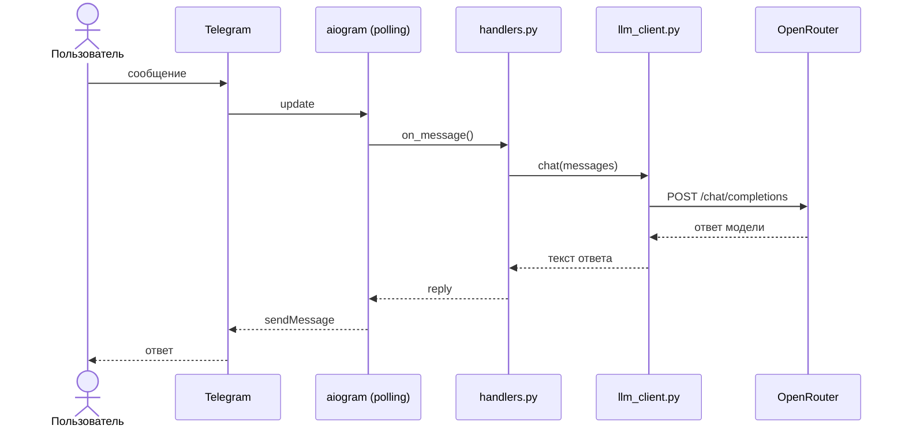

# Техническое видение проекта

## Технологии

| Назначение | Инструмент |
|---|---|
| Язык | Python 3.12+ |
| Виртуальное окружение | venv |
| Менеджер зависимостей | uv |
| Telegram-фреймворк | aiogram 3.x, polling |
| LLM-клиент | openai (OpenAI-compatible SDK) |
| LLM-провайдер | OpenRouter |
| Автоматизация | make (Makefile) |
| Линтер / форматтер | ruff |
| Конфигурация | python-dotenv, .env |

### Зависимости и окружение

- Зависимости фиксируются в `requirements.txt`.
- Виртуальное окружение создаётся через `python -m venv .venv`.
- Установка пакетов: `uv pip install -r requirements.txt`.
- Makefile предоставляет команды: `make install`, `make run`, `make lint`, `make format`.

---

## Принципы разработки

- **KISS** — минимум абстракций, понятный линейный код.
- **Один класс — один файл** — каждый модуль содержит ровно одну ответственность. Если отдельная сущность не требует собственного класса, она не выделяется в отдельную абстракцию искусственно.
- **Минимум зависимостей** — подключается только то, без чего задачу не решить.
- **Минимум инфраструктурных компонентов** — никаких брокеров, баз данных, очередей и дополнительных сервисов там, где они не нужны для MVP.
- **Минимум слоёв** — между Telegram, логикой приложения и LLM нет лишних прослоек.
- **Отказ от решений «на будущее»** — паттерны и абстракции появляются только когда нужны сейчас.
- **Читаемая структура** — явные имена классов, файлов и методов; предсказуемое расположение кода.
- **Простой запуск** — локальная разработка требует только Python, uv и `.env`-файла.
- **Конфигурация через окружение** — секреты и настройки живут в `.env`, код от них не зависит напрямую.
- **Ранний линтинг** — `ruff` запускается до коммита; код всегда отформатирован единообразно.

Если задачу можно решить без дополнительного сервиса, отдельного процесса или сложного паттерна — выбирается более простое решение.

---

## Структура репозитория

```
project-root/
├── bot/
│   ├── main.py          # точка входа, запуск polling
│   ├── handlers.py      # обработчики сообщений aiogram
│   ├── llm_client.py    # обёртка над OpenAI-compatible клиентом
│   └── config.py        # загрузка переменных окружения
├── docs/
│   ├── idea.md
│   └── vision.md
├── .env.example         # шаблон переменных окружения
├── .gitignore
├── Makefile
├── requirements.txt
└── README.md
```

- `bot/` — весь исполняемый код приложения.
- Один модуль — одна ответственность: обработчики, LLM-клиент и конфиг не смешиваются.
- `docs/` — только проектная документация, не попадает в сборку.

---

## Архитектура

Приложение — однопроцессный Telegram-бот на polling. Никаких воркеров, очередей и внешних хранилищ.



- `main.py` инициализирует бота, диспетчер и запускает polling.
- `handlers.py` принимает сообщение, формирует запрос к LLM и отправляет ответ.
- `llm_client.py` инкапсулирует вызов OpenAI-compatible API (один класс).
- `config.py` читает `.env` и предоставляет типизированные настройки.

Состояние сессии не сохраняется между перезапусками. История диалога хранится в памяти процесса (список сообщений на пользователя) и сбрасывается при перезапуске.

Для MVP не используются:
- очереди и брокеры сообщений
- фоновые воркеры
- микросервисы
- отдельные API между слоями
- внешняя база данных
- внешнее хранилище истории диалога

Зависимости между частями проекта простые и явные.

---

## Модель данных / состояние

Персистентное хранилище отсутствует. Всё состояние живёт в памяти процесса.

История диалога — словарь `dict[int, list[dict]]`, где ключ — `user_id` из Telegram, значение — список сообщений в формате OpenAI Chat:

```python
{
    123456789: [
        {"role": "system", "content": "..."},
        {"role": "user", "content": "Что такое эмбеддинги?"},
        {"role": "assistant", "content": "..."},
    ]
}
```

- История передаётся в каждый запрос к LLM целиком (контекстное окно модели).
- При перезапуске бота история сбрасывается.
- Ограничение глубины истории (количество сообщений) — опциональная настройка через `.env`.

---

## Работа с LLM

- **Провайдер:** OpenRouter (`https://openrouter.ai/api/v1`)
- **Клиент:** `openai` Python SDK в режиме совместимости (OpenAI-compatible API)
- **Модель:** задаётся через `.env` (`LLM_MODEL`), например `openai/gpt-4o-mini`

### Инициализация клиента

```python
from openai import AsyncOpenAI

client = AsyncOpenAI(
    base_url="https://openrouter.ai/api/v1",
    api_key=config.openrouter_api_key,
)
```

### Формат запроса

Сервис диалога формирует запрос к LLM из трёх частей:

1. **Системный промпт** — задаёт роль, стиль общения и общее поведение ассистента. Хранится в `.env` (`SYSTEM_PROMPT`) и загружается через конфигурацию приложения.
2. **История предыдущих сообщений** — список сообщений текущего диалога.
3. **Текущее сообщение пользователя.**

Формат сообщений — стандартный Chat Completions (роли `system`, `user`, `assistant`).

Ответ модели возвращается в текстовом виде и отправляется пользователю в Telegram без дополнительной обработки.

### Параметры

| Параметр | Источник |
|---|---|
| `model` | `LLM_MODEL` в `.env` |
| `temperature` | `LLM_TEMPERATURE` в `.env` (по умолчанию `0.7`) |
| `max_tokens` | `LLM_MAX_TOKENS` в `.env` (опционально) |

### Ограничения MVP

Не используются:
- function calling и tools
- streaming
- мультимодальность
- несколько моделей для разных задач
- автоматический выбор модели
- сложные цепочки промптов

### Обработка ошибок

Если запрос к LLM завершается ошибкой, пользователь получает простое понятное сообщение без технических деталей.

---

## Сценарии работы пользователя

### Основной сценарий

1. Пользователь отправляет текстовое сообщение боту.
2. Бот добавляет сообщение в историю диалога.
3. Бот отправляет запрос к LLM (системный промпт + история + сообщение).
4. Бот отправляет ответ модели пользователю.
5. Ответ добавляется в историю диалога.

### Команда `/start`

Бот отправляет приветственное сообщение и сбрасывает историю диалога.

### Команда `/reset`

Сбрасывает историю диалога пользователя — следующий запрос начнётся с чистого контекста.

### Ошибка LLM

Если запрос к модели не удался, бот отвечает нейтральным сообщением об ошибке и не добавляет ничего в историю.

### Неподдерживаемый тип сообщения

Если пользователь отправляет не текст (фото, файл, голос и т.д.), бот сообщает, что поддерживает только текстовые сообщения.

### Ограничения MVP

Не реализуются:
- сценарии администрирования и модерации
- переключение ролей пользователем
- работа с файлами и голосом
- групповые чаты

---

## Конфигурация и секреты

Все настройки загружаются из `.env` через `python-dotenv`. Код не содержит значений по умолчанию для секретов.

### Переменные окружения

| Переменная | Описание | Обязательна |
|---|---|---|
| `BOT_TOKEN` | Telegram Bot API токен | да |
| `OPENROUTER_API_KEY` | Ключ OpenRouter | да |
| `LLM_MODEL` | Идентификатор модели, например `openai/gpt-4o-mini` | да |
| `SYSTEM_PROMPT` | Системный промпт для ассистента | да |
| `LLM_TEMPERATURE` | Температура генерации (по умолчанию `0.7`) | нет |
| `LLM_MAX_TOKENS` | Максимум токенов в ответе | нет |
| `MAX_HISTORY_MESSAGES` | Лимит сообщений в истории диалога | нет |
| `LOG_LEVEL` | Уровень логирования (по умолчанию `INFO`) | нет |

### Правила

- `.env` не коммитится в репозиторий (в `.gitignore`).
- В репозитории хранится `.env.example` со всеми ключами и пустыми значениями.
- Конфигурация загружается один раз при старте в `config.py` и передаётся как зависимость.

---

## Логирование

Используется стандартный модуль `logging` из Python stdlib. Сторонние библиотеки для логирования не подключаются.

### Уровни

- `INFO` — запуск бота, входящие сообщения (без текста), ответы LLM получены.
- `WARNING` — нештатные ситуации, не прерывающие работу (например, пустой ответ модели).
- `ERROR` — ошибки при запросе к LLM, необработанные исключения.

### Правила

- Персональные данные пользователей (текст сообщений, имена) в лог не пишутся.
- Логируется `user_id` и факт события, но не содержимое.
- Уровень логирования задаётся через `.env` (`LOG_LEVEL`, по умолчанию `INFO`).
- Логи выводятся в stdout; перенаправление — на усмотрение среды запуска.

### Запрещено логировать

- токены и API-ключи
- системный промпт
- полные пользовательские данные
- любые чувствительные значения из `.env`

---

## Сборка и запуск

### Локальный запуск

```bash
python -m venv .venv
source .venv/bin/activate  # Windows: .venv\Scripts\activate
uv pip install -r requirements.txt
cp .env.example .env       # заполнить значения
make run
```

### Makefile

| Команда | Действие |
|---|---|
| `make install` | Создать окружение и установить зависимости |
| `make run` | Запустить бота |
| `make lint` | Проверить код через `ruff` |
| `make format` | Отформатировать код через `ruff format` |

### Деплой

Проект разворачивается как одно приложение в одном процессе. Приложение запускается в режиме polling с предварительно настроенным `.env`.

Целевой подход:
1. Подготовить `.env`.
2. Собрать и запустить контейнер одной командой.

Деплой должен быть простым, повторяемым и понятным без дополнительной инфраструктурной сложности.

Для MVP не требуются:
- Kubernetes
- webhook-инфраструктура
- отдельные очереди и сервисы
- отдельный сервер приложений
- сложные CI/CD-пайплайны
